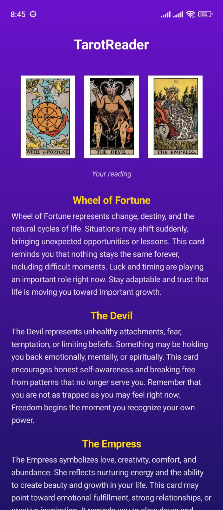

# 🔮 TarotReader

TarotReader is an Android app built with Kotlin and Jetpack Compose that allows users to draw 3 random tarot cards from the 22 Major Arcana cards and receive a tarot interpretation based on the selected cards.

## ✨ Features

- 🎴 Draw 3 random tarot cards
- 🔀 Randomized card selection from the 22 Major Arcana
- 📖 Tarot interpretation after drawing cards
- 🎨 Modern UI built with Jetpack Compose
- ⚡ Lightweight and simple experience

---

## 📱 Screenshots

### Home Screen


### Interpretation Screen


---

## 🛠️ Tech Stack

- **Kotlin**
- **Jetpack Compose**
- Android SDK

---

## 🚀 Getting Started

Clone the repository:

```bash
git clone https://github.com/yourusername/TarotReader.git
```

Open the project in Android Studio and run the app on an emulator or physical device.

---

## 📂 Project Structure

```text
app/
├── ui/
├── screens/
├── components/
├── data/
└── utils/
```

---

## 🔮 How It Works

1. User starts a tarot reading
2. The app randomly selects 3 cards from the Major Arcana deck
3. Selected cards are displayed
4. A tarot interpretation is generated based on the drawn cards

---

## 🎴 Tarot Deck

This app currently uses the **22 Major Arcana** tarot cards.

Examples include:
- The Fool
- The Magician
- The High Priestess
- The Lovers
- Death
- The World

---

## 📌 Future Improvements

- Full 78-card tarot deck support
- Card animations
- Daily tarot reading
- Save reading history
- Dark mode improvements
- Better interpretation engine

---

## 🤝 Contributing

Contributions, issues, and feature requests are welcome.

Feel free to fork the project and submit a pull request.

---

## 📄 License

This project is licensed under the MIT License.

---

## ⭐ Support

If you like this project, consider giving it a star on GitHub ⭐
